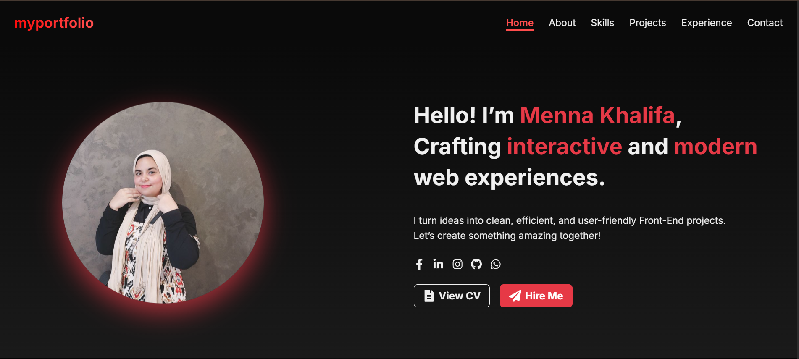
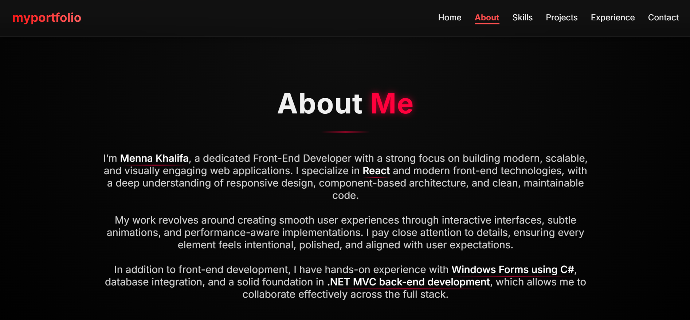
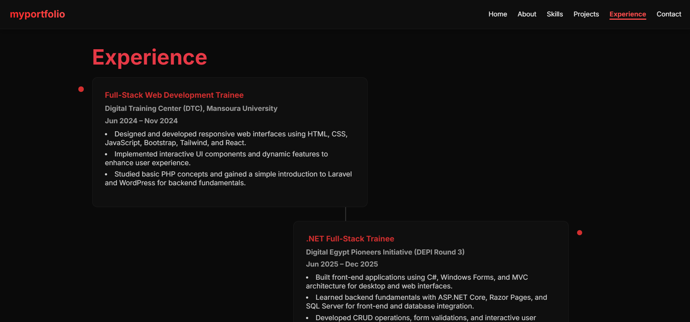
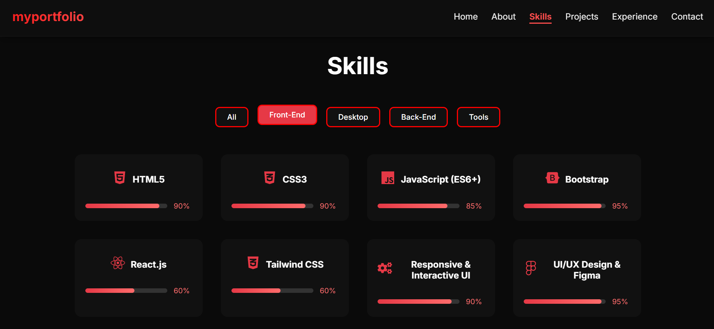
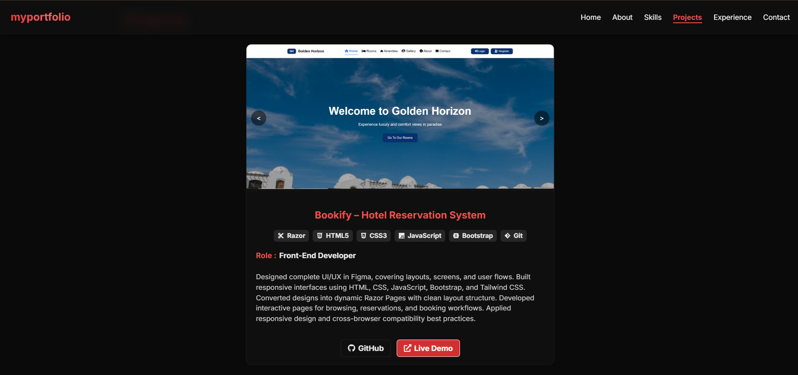
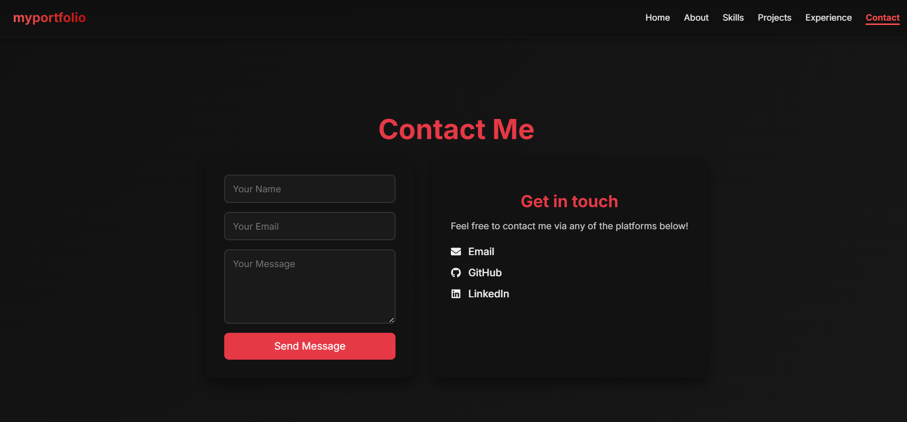

# My Portfolio

Live Demo: https://fabulous-granita-a79b39.netlify.app/

## Project Description
This is a personal portfolio single-page application built with React and Vite. It showcases my work and skills in a fully responsive design, utilizing a component-based architecture.


## Overview
The purpose of this portfolio is to present my professional background and projects. The sections included are:
- Home
- About
- Experience
- Skills
- Projects
- Contact

## Screenshots
### Home
  
*Alt text: Home section of the portfolio.*

### About
  
*Alt text: About section of the portfolio.*

### Experience
  
*Alt text: Experience section of the portfolio.*

### Skills
  
*Alt text: Skills section of the portfolio.*

### Projects
  
*Alt text: Projects section of the portfolio.*

### Contact
  
*Alt text: Contact section of the portfolio.*

## Features
- Fully responsive design
- Smooth navigation
- Simple scroll reveal animations
- Component-based architecture
- Utilizes react-icons
- Linting with ESLint

## Tech Stack
- React
- Vite
- JavaScript (ES6+)
- CSS3
- React Icons
- ESLint

## Getting Started
### Prerequisites
- Node.js LTS
- npm

### Installation
Run the following command to install the necessary packages:
```
npm install
```

### Run Locally
To run the application locally, use:
```
npm run dev
```
Access the application at: [http://localhost:5173](http://localhost:5173)

### Build for Production
To build the application for production, use:
```
npm run build
```

## Project Structure
```
public/
└── screenshots/
    ├── home.png
    ├── about.png
    ├── experience.png
    ├── skills.png
    ├── projects.png
    └── contact.png
src/
├── assets/         # Images, icons, etc.
├── components/     # React components
├── styles/         # Global and component CSS files
└── utils/          # Utility functions

```

## Customization
To customize the portfolio, edit the components located in the `src/components` directory, adjust styles in the `src/App.css` and individual component CSS files, and replace screenshots in the `public/screenshots` folder.

## Deployment
This portfolio can be deployed using platforms such as Netlify, Vercel, or GitHub Pages.

## Author
**Name:** Menna Khalifa  
**Title:** Frontend Developer  
**GitHub:** https://github.com/Menna-Khalifa  
**LinkedIn:** https://www.linkedin.com/in/menna-khalifa-amer/
 

## License
This project is for personal/portfolio use only.
